> *Dear visitor,*
>
> *Thank you for stopping by. I'm Manas, a software engineer pursuing my Master's in Computer Science at **Arizona State University**. Before graduate school I spent two years building real systems: order-management platforms at **EQG Glassmach** and microservice back-ends at **Brillio**, where API and architecture work made one application **30% faster**.*
>
> *Lately I've been living where software meets machine learning: vision transformers that learn to click through dashboards, speech models that listen to care calls, and language models that turn documents into maps of ideas.*
>
> *Yours, under the same sky,* 
> *Manas*

<i>Certified in</i> <b>Machine Learning</b> (Stanford) · <b>ML Foundations</b> (University of Washington) · <b>OCI Foundations</b> (Oracle)

<i>More stars in the</i> <a href="https://github.com/ManasKhare3005?tab=repositories">repositories</a> <i>sky: AI, web, backend, automation &amp; cloud.</i>

<picture>
  <source media="(prefers-color-scheme: dark)" srcset="https://raw.githubusercontent.com/ManasKhare3005/ManasKhare3005/output/github-snake-dark.svg"/>
  <source media="(prefers-color-scheme: light)" srcset="https://raw.githubusercontent.com/ManasKhare3005/ManasKhare3005/output/github-snake.svg"/>
  
</picture>

