<div align="center">




<a href="https://www.linkedin.com/in/manas-khare-3b377818b"></a>
<a href="https://manaskhare.netlify.app/"></a>


</div>



## ◉ Layer 0 · Input — *who is this?*

I'm a **final-year M.S. Computer Science** student at **Arizona State University**. I like taking an idea from a napkin sketch to production, combining **backend engineering**, **modern web** and **AI** to solve real problems.

```yaml
model_card:
  name:            manas-khare
  version:         2026.final-year
  architecture:    Full-Stack Engineer ⨉ ML / AI
  pretraining:     B.Tech. CSE @ SRM  →  M.S. CS @ Arizona State University
  fine_tuning:     2 yrs industry · EQG Glassmach · Brillio (+30% app efficiency)
  specializations: [LLM apps, RAG, vision transformers, speech (Whisper), microservices]
  domains:         [FinTech 📈, HealthTech 🏥, Productivity ⚡]
  objective:       join a high-impact software engineering team
  inference:       ✅ open to SWE opportunities
```


## ◉ Live inference — *right now*




## ◉ Training history — *the journey so far*



<p align="center"><sub>📜 Certified: <b>Machine Learning</b> (Stanford) · <b>ML Foundations</b> (University of Washington) · <b>OCI Foundations</b> (Oracle)</sub></p>


## ◉ Layer 1 · Hidden — *things I've built*

<a href="https://github.com/ManasKhare3005?tab=repositories"></a>
<a href="https://github.com/ManasKhare3005/Resumify"></a>
<a href="https://github.com/ManasKhare3005/CuraConnect"></a>

<p align="center"><sub>⭐ More neurons in my <a href="https://github.com/ManasKhare3005?tab=repositories">repositories</a>: AI, web, backend, automation &amp; cloud.</sub></p>


## ◉ Layer 2 · Weights — *my stack*




## ◉ Layer 3 · Activations — *training metrics*

<div align="center">


<picture>
  <source media="(prefers-color-scheme: dark)" srcset="https://raw.githubusercontent.com/ManasKhare3005/ManasKhare3005/output/github-snake-dark.svg"/>
  <source media="(prefers-color-scheme: light)" srcset="https://raw.githubusercontent.com/ManasKhare3005/ManasKhare3005/output/github-snake.svg"/>
  
</picture>

</div>


## ◉ Output — *let's connect*

<div align="center">

Recruiting, collaborating, or just want to talk about AI? **The network is listening.**

<a href="https://www.linkedin.com/in/manas-khare-3b377818b"></a>
<a href="https://manaskhare.netlify.app/"></a>

<br/><br/>

<sub><i>"The best way to predict the future is to build it."</i></sub>

</div>
